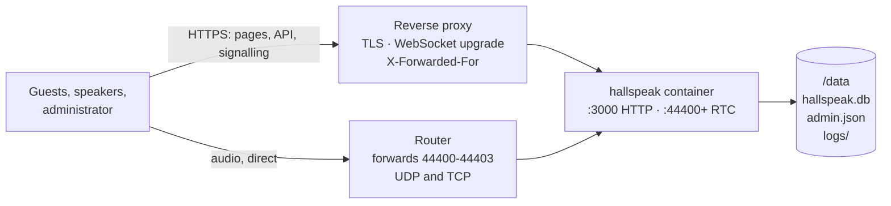

# Hosting Hallspeak

One container behind a reverse proxy you supply. You need `compose.yaml` and
`.env.example` from the [latest release](https://github.com/simon-vajda/hallspeak/releases/latest)
— take them from the release, not from `main`, which can name a version not yet published.
GitHub renames release files that start with a dot, so the release lists it as `env.example`.

## Run it

### 1. Settings

Save `.env.example` as `.env` next to `compose.yaml` and set:

- **`PUBLIC_ADDRESS`** (required) — where guests reach this server for audio: your public
  hostname, usually the one your proxy serves (`hallspeak.example.com`), or your public IP
  if you have none. Audio bypasses the proxy, so this must be reachable from the internet
  on the RTC ports. A hostname is re-resolved every minute, so a dynamic IP behind a
  dynamic-DNS name keeps working — see [dynamic IP addresses](#dynamic-ip-addresses).
- **`TRUSTED_PROXY_IPS`** (recommended) — the address your proxy connects to the container
  from. Without it, every visitor shares one sign-in throttle bucket. It is rarely the
  address you expect: see [`TRUSTED_PROXY_IPS`](#trusted_proxy_ips).
- **`HALLSPEAK_DATA_DIR`** (optional) — the host directory holding all of your state.
  Defaults to `./data` beside `compose.yaml`.

Every other setting, with its default and what it does, is documented in `.env.example`.

### 2. Ports

| Port          | Protocol        | Who must reach it                         | Purpose                         |
| ------------- | --------------- | ----------------------------------------- | ------------------------------- |
| `3000`        | TCP             | Only your reverse proxy, not the internet | Web app and API, as plain HTTP  |
| `44400–44403` | UDP **and** TCP | Guests — forward them on your router      | Audio                           |

Port 3000 carries no encryption and serves the setup wizard, so keep it closed to the
internet and let guests in only through your proxy.

To use different ports for audio, don't remap the defaults in `compose.yaml` — the ports
must be the same outside and inside the container. Instead set `MEDIA_RTC_PORT_BASE` in
`.env` and change both port ranges in `compose.yaml` to match. Open one port per worker:
`MEDIA_MAX_WORKERS` ports counting up from `MEDIA_RTC_PORT_BASE` (see
[cores and events](#cores-events-and-ports)).

### 3. Reverse proxy

Your proxy needs to terminate TLS, pass WebSocket upgrades for `/api/socket.io`, and
append `X-Forwarded-For`. HTTPS is not optional: without it the browser won't allow
microphone access, and signing in fails silently.

**Caddy** does all three unprompted:

```caddy
hallspeak.example.com {
    reverse_proxy 127.0.0.1:3000
}
```

**nginx**:

```nginx
map $http_upgrade $connection_upgrade {
    default upgrade;
    ''      close;
}

server {
    listen 443 ssl;
    server_name hallspeak.example.com;
    # ssl_certificate and ssl_certificate_key for your certificate

    location / {
        proxy_pass http://127.0.0.1:3000;
        proxy_http_version 1.1;
        proxy_set_header Host              $host;
        proxy_set_header X-Forwarded-For   $proxy_add_x_forwarded_for;
        proxy_set_header X-Forwarded-Proto $scheme;
        proxy_set_header Upgrade           $http_upgrade;
        proxy_set_header Connection        $connection_upgrade;
        proxy_read_timeout 300s;
    }
}
```

**Nginx Proxy Manager** — put it on this service's network (add `networks:` to
`compose.yaml` naming the one NPM is on) and add a Proxy Host: scheme `http`, Forward
Hostname `hallspeak`, Forward Port `3000`, **Websockets Support on**, and on the SSL tab
request a certificate with Force SSL.

### 4. Start it with Docker Compose

```sh
docker compose up -d
```

Then open your HTTPS URL promptly: the setup wizard gives the admin account to whoever
reaches it first.

### Check the logs

```sh
docker compose logs -f
```

Check the media line against what the internet actually sees — a wrong public address is
the one failure that produces no error:

```text
mediasoup: 4 worker(s) of 8 detected core(s) · ports 44400, 44401, 44402, 44403 (UDP and TCP) · guests connect to 203.0.113.10
```

### Alternative: `docker run`

```sh
docker run -d --name hallspeak --restart unless-stopped \
  -e PUBLIC_ADDRESS=hallspeak.example.com \
  -e TRUSTED_PROXY_IPS=172.17.0.1 \
  -p 3000:3000 \
  -p 44400-44403:44400-44403/udp \
  -p 44400-44403:44400-44403/tcp \
  -v /srv/hallspeak/data:/data \
  ghcr.io/simon-vajda/hallspeak:latest
```

`172.17.0.1` is the default bridge gateway, which is what a proxy on the host appears as;
confirm yours with `docker network inspect bridge`. Pin a version tag instead of `latest`
to control upgrades, and add `--env-file .env` to use the remaining settings from
`.env.example`.

## How it fits together

Two paths reach the container, and only one of them goes through your proxy. Almost
every deployment failure is a confusion between them.



- **Pages and signalling** go through the proxy over HTTPS.
- **Audio never touches the proxy.** It goes straight to the forwarded RTC ports.
- **`/data` is all of your state.** Its `logs/` subdirectory is diagnostics, not state.

## Prove audio works

Loading the page proves nothing. Create an event and a channel, enable both, go live in
the speaker studio, then open the listener page **from a phone on mobile data with Wi-Fi
off** — a listener on your own LAN can succeed or fail for reasons no real guest hits.

## `TRUSTED_PROXY_IPS`

Hallspeak believes `X-Forwarded-For` only from connections arriving from a listed
address — an exact list, not CIDR. The value is the address **the container sees the
proxy connect from**.

Container addresses can move on recreate, so pin the proxy's address if this must
survive unattended.

## Cores, events and ports

One event runs on one CPU core, start to finish. `MEDIA_MAX_WORKERS` (default 4) is how
many cores Hallspeak may use, so it sets how many events run in parallel and limits a
crash to the events on one core — it never makes a single event bigger. It is capped by
the host's core count; if you only run one event at a time, `1` is honest.

Each core in use needs one port, counting up from `MEDIA_RTC_PORT_BASE` (44400). If you
change either setting, edit the port ranges in `compose.yaml` and your router forwarding
to match; Compose cannot derive a range from a variable.

## Upgrading and backups

Set `HALLSPEAK_VERSION` in `.env` to the new release. If that release's `compose.yaml` or
`.env.example` differs from yours, carry the changes over first. Then:

```sh
docker compose pull && docker compose up -d
```

Migrations run at boot; the data directory is untouched.

## Dynamic IP addresses

Dynamic DNS is supported. Point a DDNS name at your connection and set `PUBLIC_ADDRESS`
to it. Hallspeak re-resolves the name every minute, so when your IP changes new
connections use the new address without a restart, and connected guests reconnect on
their own within seconds.

## When it doesn't work

| Symptom                                                                 | Cause                                                                         | Fix                                                                                                                                       |
| ----------------------------------------------------------------------- | ----------------------------------------------------------------------------- | ----------------------------------------------------------------------------------------------------------------------------------------- |
| Every screen loads, nobody hears anything                               | `PUBLIC_ADDRESS` is wrong, or the RTC ports are not forwarded                 | Check the address in the startup log (or `curl -s https://api.ipify.org`); forward 44400–44403 on **both** UDP and TCP, without remapping |
| The browser won't allow microphone access; signing in does nothing      | Plain HTTP                                                                    | Use the proxy's HTTPS URL, not `http://<host>:3000`                                                                                       |
| Container exits with `/data is not writable`                            | Read-only mount, or a uid that does not own the directory                     | Drop `:ro`; set `PUID`/`PGID` to the owner, or `chown` it on the host if you set Docker's `user:` yourself                                |
| A correct password is refused after a few tries                         | `TRUSTED_PROXY_IPS` unset behind a proxy                                      | See [`TRUSTED_PROXY_IPS`](#trusted_proxy_ips)                                                                                             |
| Everyone shares one throttle bucket although `TRUSTED_PROXY_IPS` is set | Proxy not appending `X-Forwarded-For`, or connecting from an unlisted address | The log warns once about each, naming the address it saw                                                                                  |
| Only listeners on your own LAN hear nothing                             | Router lacks NAT hairpinning                                                  | Split-horizon DNS on the LAN                                                                                                              |
| Container exits naming private or loopback addresses                    | Hostname answered by a LAN resolver                                           | Set `PUBLIC_ADDRESS` to your public IP, or give the container a public resolver                                                           |
| Audio breaks for some listeners, not others                             | Not a deployment fault                                                        | [`diagnosing-live-audio-from-a-user-report.md`](solutions/operations/diagnosing-live-audio-from-a-user-report.md)                         |

A guest on a network blocking **both** UDP and TCP to the RTC ports — some corporate and
hotel networks — cannot receive audio.

## Reading the log

`docker compose logs hallspeak` is written to be pasted into a bug report as-is. The
default `info` level costs the same handful of lines whether five people listened or five
hundred; a broken deployment is louder on purpose, warning once per listener whose
connection carried no audio.

If asked for more, raise `LOG_LEVEL` to `debug`, recreate the container, reproduce the
problem, then set it back. **`trace` adds the network addresses of the people
listening**, both on screen and in `/data/logs`, where it stays for the 14-day retention
window — read an excerpt before you share it.

Docker discards a container's output when an upgrade recreates it, so Hallspeak keeps its
own copy in `/data/logs` (`hallspeak.<date>.<n>.log`, one JSON object per line). Set
`LOG_DIR` empty to decline it.
