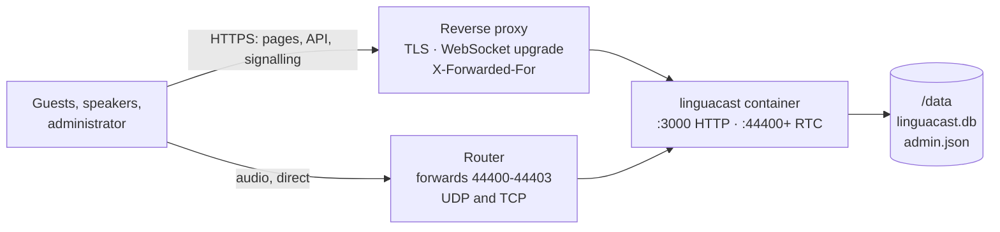

# Hosting LinguaCast

One container, behind a reverse proxy you supply. Files you need:
[`compose.yaml`](../compose.yaml) and [`.env.example`](../.env.example).

## How it fits together

Two paths reach the container, and only one of them goes through your proxy. Almost
every deployment failure is a confusion between them.



- **Pages and signalling** go through the proxy over HTTPS. Without TLS the speaker
  studio cannot open a microphone and signing in fails silently, because the session
  cookie is a `__Host-` cookie the browser discards.
- **Audio never touches the proxy.** It goes straight to the RTC ports, so those must
  be forwarded on your router and published one-to-one — the port a guest dials is the
  port inside the ICE candidate, so remapping it breaks audio while leaving every
  screen looking healthy.
- **`/data` is all of your state.** Back it up; nothing else survives a recreate.

## Prerequisites

- A reverse proxy terminating TLS for a hostname pointing at this server.
- Router forwarding for **44400–44403, UDP and TCP**, to the host running the container —
  one port per worker, which is four by default. See below if you change that.
- A public address stable enough to put in a config file, and a host on Linux kernel 6
  or newer.

## Deploy

Make a directory, and put [`compose.yaml`](../compose.yaml) in it alongside
[`.env.example`](../.env.example) copied to `.env`:

```sh
mkdir -p /srv/linguacast/data && cd /srv/linguacast
```

Edit `.env`. Only `MEDIA_ANNOUNCED_IP` is mandatory — the public address guests reach
this server at. Then:

```sh
docker login ghcr.io -u <your-github-username>   # while the package is private
docker compose up -d && docker compose logs -f
```

Look for the media line, and check the announced address against what the internet
actually sees:

```
mediasoup: 4 worker(s) of 8 detected core(s) · ports 44400, 44401, 44402, 44403 (UDP and TCP) · announced 203.0.113.10 · TURN not configured
```

Configure your proxy (below), then open the HTTPS URL. The setup wizard claims the
admin account for whoever reaches it first, so do this promptly.

### How many RTC ports to forward

That log line names them: forward exactly the ports it lists, on UDP and TCP, with no
remapping.

The count comes from the worker layout. LinguaCast runs one mediasoup worker per CPU
core, capped by `MEDIA_MAX_WORKERS`, and worker *i* binds `MEDIA_RTC_PORT_BASE + i`.
So four workers means four ports — 44400 through 44403 by default — and the number
scales with your worker count, never with how many people are listening.

Worker count is worth thinking about once, because raising it is not a performance
knob:

- **An event lives entirely on one worker, and is never split across two.** One event
  is therefore capped at one core no matter how many workers you allow. Adding workers
  buys you *concurrent events on separate cores*, plus crash isolation — one worker
  dying does not silence the others.
- **So size it by how many events run at the same time**, not by audience or by core
  count. If you will only ever run one event at a time, `MEDIA_MAX_WORKERS=1` is
  honest and needs one forwarded port.
- The effective count is the smaller of your setting and the host's cores, so asking
  for more workers than you have cores just opens ports that nothing binds.

If you change `MEDIA_MAX_WORKERS`, edit the port publications in `compose.yaml` by
hand and re-forward on the router — Compose cannot derive a range from a variable.

## Reverse proxy

Each proxy needs the same three things: TLS, WebSocket upgrades passed through for
`/api/socket.io`, and the visitor's address appended so the sign-in throttle can tell
callers apart.

**Caddy** — does all three unprompted:

```caddy
linguacast.example.org {
    reverse_proxy 127.0.0.1:3000
}
```

**nginx** — with `map $http_upgrade $connection_upgrade { default upgrade; '' close; }`
in the `http { }` block, inside your TLS server:

```nginx
location / {
    proxy_pass http://127.0.0.1:3000;
    proxy_http_version 1.1;
    proxy_set_header Host              $host;
    proxy_set_header X-Forwarded-For   $proxy_add_x_forwarded_for;
    proxy_set_header X-Forwarded-Proto $scheme;
    proxy_set_header Upgrade           $http_upgrade;
    proxy_set_header Connection        $connection_upgrade;
    proxy_read_timeout 300s;
}
```

**Nginx Proxy Manager** — add a Proxy Host: scheme `http`, forward to the container's
host and port `3000`, **Websockets Support on**. On the SSL tab, request a certificate
and enable Force SSL. It appends `X-Forwarded-For` on its own.

### `TRUSTED_PROXY_IPS`

LinguaCast believes an `X-Forwarded-For` header only when the connection itself arrives
from an address you listed. Left empty behind a proxy, every visitor shares one sign-in
throttle bucket — so anyone hitting your login page spends the budget you need. It is
an exact list, not a CIDR range.

The value is the address **the container sees the proxy connect from**, which is rarely
the proxy's LAN address:

| Where the proxy runs | What to set | How to find it |
|---|---|---|
| On the host, reaching a published port | The Compose network's gateway, e.g. `172.18.0.1` | `docker network inspect linguacast_default -f '{{range .IPAM.Config}}{{.Gateway}}{{end}}'` |
| As a container on a shared Docker network | That container's address on the network | `docker inspect <proxy> -f '{{range .NetworkSettings.Networks}}{{.IPAddress}} {{end}}'` |

Container addresses can move on recreate, so pin the proxy's address if you want this
to survive unattended.

## Prove audio works

Loading the page proves nothing. Create an event and a channel, enable both, go live in
the speaker studio, then open the listener page **from a phone on mobile data with Wi-Fi
off**. Not the venue Wi-Fi, and not the same LAN as the server — a listener on your own
LAN can succeed or fail for reasons no real guest will ever hit.

## Upgrading and backups

Upgrade by editing `LINGUACAST_VERSION` in `.env`, then:

```sh
docker compose pull && docker compose up -d
```

Migrations run at boot before the server accepts a request, and `data/` is untouched.

Back up `data/` with the container stopped — SQLite runs in WAL mode, so a live copy can
capture a mid-transaction write:

```sh
docker compose stop && tar czf backup-$(date +%F).tar.gz data/ && docker compose start
```

## When it doesn't work

| Symptom | Cause | Fix |
|---|---|---|
| Every screen loads, nobody hears anything | `MEDIA_ANNOUNCED_IP` is wrong, or the RTC ports are not forwarded | Compare the announced address in the logs with `curl -s https://api.ipify.org`; confirm the router forwards 44400–44403 on **both** UDP and TCP; confirm you did not remap the ports |
| The studio cannot open the microphone; signing in does nothing | You are on plain HTTP | Use the proxy's HTTPS URL, not `http://<host>:3000` |
| Container exits with `/data is not writable` | Read-only mount, or a `user:` uid that does not own it | Drop the `:ro`, or set `PUID`/`PGID` to the owner |
| A correct password is refused after a few tries | `TRUSTED_PROXY_IPS` unset behind a proxy | See the table above |
| Only listeners on your own LAN hear nothing | Your router does not do NAT hairpinning | Split-horizon DNS on the LAN — a router problem, not a LinguaCast one |
| Audio breaks for some listeners, not others | Not a deployment fault | [`docs/solutions/operations/diagnosing-live-audio-from-a-user-report.md`](solutions/operations/diagnosing-live-audio-from-a-user-report.md) |

## What this deployment cannot serve

Guests connect straight to the RTC ports on UDP, falling back to TCP. A network blocking
**both** — some corporate and hotel networks — needs a TURN relay to carry the audio.
The server supports one (`MEDIA_TURN_URL` and `MEDIA_TURN_SECRET`), but standing a relay
up is its own deployment and this guide does not cover it.

`MEDIA_STUN_URL` defaults to a public server, which helps a guest behind a restrictive
NAT discover the address to advertise. Set it empty to use none.

## Every setting

All of these go in `.env`. Everything except `MEDIA_ANNOUNCED_IP` has a working
default, and the last four rows are ones you should not normally need to touch.

| Variable | Default | What it does |
|---|---|---|
| `LINGUACAST_VERSION` | — | The image tag Compose runs. Edit it, pull, recreate: that is the upgrade. |
| `MEDIA_ANNOUNCED_IP` | **required** | The public address that goes into ICE candidates. Wrong means every screen loads and no audio arrives. |
| `TRUSTED_PROXY_IPS` | empty | Comma-separated addresses whose `X-Forwarded-For` is believed. Empty means none is, which behind a proxy shares one sign-in throttle bucket across every visitor. |
| `MEDIA_MAX_WORKERS` | `4` | Concurrent events given their own core, capped by the host's core count. Each worker binds one RTC port. |
| `MEDIA_RTC_PORT_BASE` | `44400` | The first RTC port. Worker *i* binds base + *i* on UDP and TCP. Change it and change the publications and the router forwarding. |
| `MEDIA_STUN_URL` | `stun:stun.l.google.com:19302` | Helps a guest behind a restrictive NAT discover the address to advertise. Empty uses none. |
| `MEDIA_TURN_URL` | unset | A TURN relay that carries audio for guests whose network blocks the RTC ports. Needs the secret below to apply. |
| `MEDIA_TURN_SECRET` | unset | The relay's shared secret. Per-session credentials are minted from it; it never reaches a client. |
| `PUID` / `PGID` | `1000` | The uid/gid the server runs as, and the owner the container gives the data directory. |
| `MEDIA_ROOM_IDLE_GRACE_MS` | `60000` | How long an event's router survives with nobody on it. Shorter renegotiates every guest during a handover between interpreters. |
| `DATA_DIR` | `/data` | Where `linguacast.db` and `admin.json` live. Change the mount, not this. |
| `PORT` | `3000` | The HTTP port inside the container. Publish a different one instead of changing this. |
| `MEDIA_LISTEN_IP` | `0.0.0.0` | What the workers bind inside the container. |
